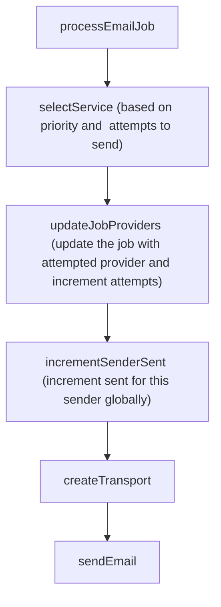

TODO: move this to dedicated docs site

# Sender.ts

Handles sending emails.

## Flow

If any unhandled errors occur, the email send will retry via the MQ retry mechanism.

# ResetCount.ts

Resets the count of a service every month, based on the Application Config